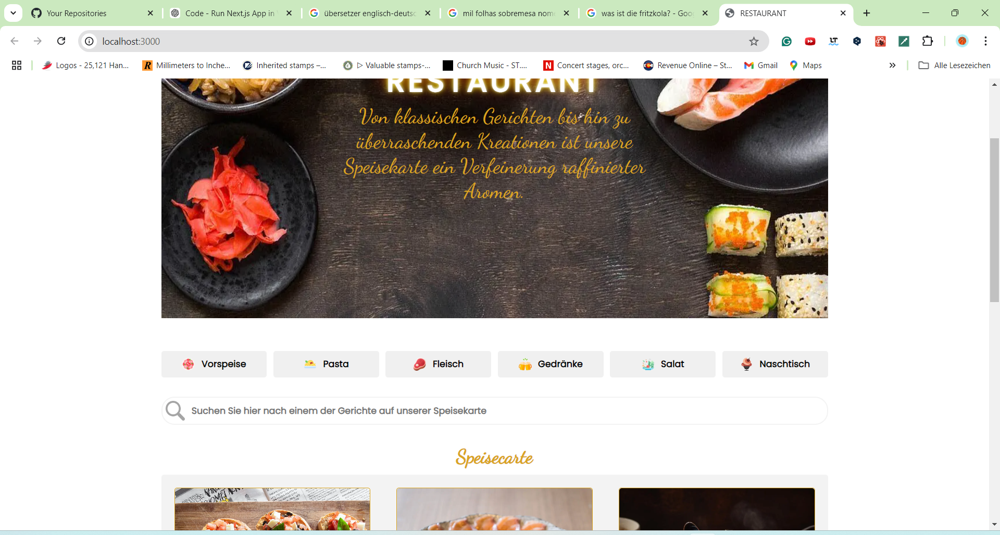
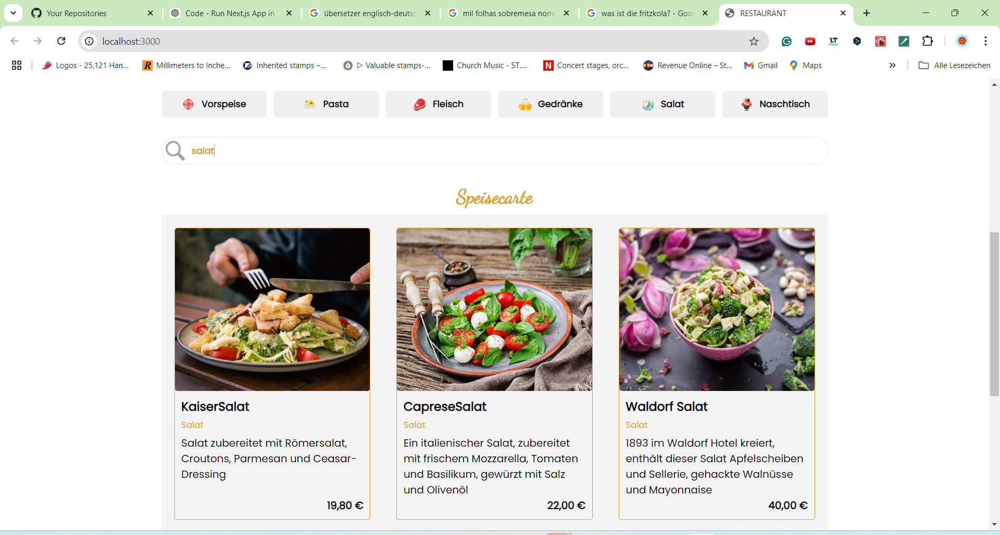
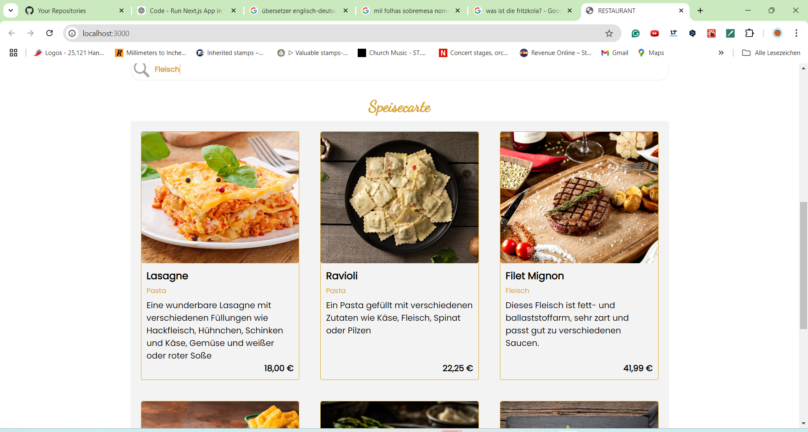
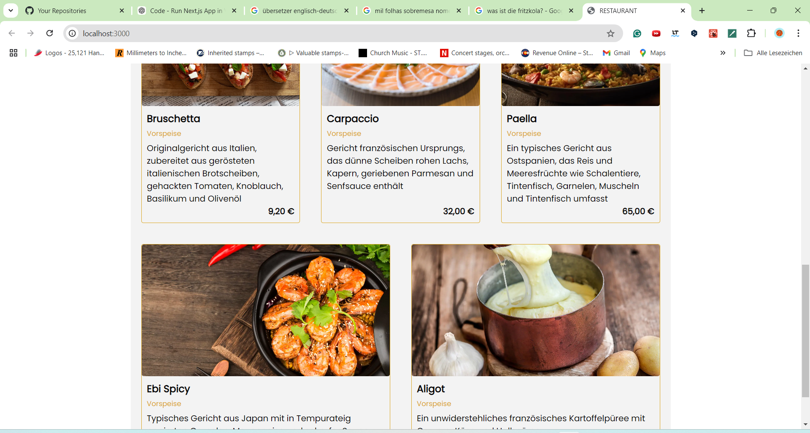

# Restaurant Speisekarte

**Interactive German Restaurant Menu System - Next.js & React**

## About

Complete restaurant menu application featuring German cuisine categories with interactive filtering, search functionality, and responsive design. Built with modern Next.js architecture and deployed with automated CI/CD integration.

## Description
This project showcases a modern restaurant menu system designed for German dining establishments. It features category-based navigation, real-time search capabilities, and optimized image delivery. The application demonstrates clean component architecture, responsive design principles, and professional deployment practices with automated pipelines.

  


**📅 Last Updated:** October 21, 2025 - CI/CD pipeline implementation complete  
**🏗️ Status:** Production-ready | Live deployment | Comprehensive documentation

---

## Table of contents

1. [Screenshots](#screenshots)
2. [Project status](#project-status)
3. [Features](#features)
4. [Documentation](#documentation)
   - [Architecture Overview](#architecture-overview)
   - [Index for Architecture docs](#index-for-architecture-docs)
5. [Tech stack](#tech-stack)
6. [Environment profiles (CI/CD)](#environment-profiles)
7. [Available Scripts](#available-scripts)
8. [Deployment](#deployment)

---

<a id="screenshots"></a>
## Screenshots



# Search Example screen showing "Salat" and "Fleisch"





# Example with "Nudeln":



---

<a id="project-status"></a>
## Project status

### ✅ Frontend Development - Complete
- ✅ Next.js application with React 18
- ✅ Category-based filtering system
- ✅ Real-time search functionality
- ✅ Responsive design with CSS modules
- ✅ Image optimization with Next.js Image component
- ✅ German localization and EUR currency formatting

### ✅ CI/CD Pipeline - Complete
- ✅ Automated testing and linting
- ✅ Separate pipelines for code and documentation
- ✅ Automated deployment to Vercel
- ✅ Build optimization and verification

---

<a id="features"></a>
## 🚀 Features

### 🎯 Core Functionality
- 📋 **Interactive Menu Categories**: Vorspeise, Pasta, Fleisch, Getränke, Salat, Nachtisch
- 🔍 **Real-time Search**: Search by dish name or description
- 🖼️ **Optimized Images**: Next.js Image component for performance
- 💰 **Currency Formatting**: German locale with EUR formatting
- 📱 **Responsive Design**: Mobile-first approach with CSS modules

### 🎨 User Experience
- Clean, intuitive interface design
- Fast category switching with visual feedback
- Instant search results
- Professional food photography presentation
- Smooth navigation and interactions

---

<a id="documentation"></a>
## 📘 Documentation

<a id="architecture-overview"></a>
### 🏗️ Architecture Overview

This application follows modern Next.js architecture patterns with clear separation of concerns:

- **Component Architecture**: Reusable React components with CSS modules
- **Data Management**: Centralized product data with service layer
- **State Management**: React hooks for local state and props drilling
- **Styling Strategy**: CSS modules for component-scoped styling
- **Performance**: Next.js Image optimization and static generation

<a id="index-for-architecture-docs"></a>
### 📚 Index for Architecture docs

- [📁 Complete Architecture Documentation](./docs/README.md) — Comprehensive architecture documentation hub
- [🏗️ System Architecture Overview](./docs/architecture/system-overview.md) — High-level system design and component interaction
- [📦 Component Documentation](./docs/architecture/components/) — Detailed component specifications
- [🎯 Design Patterns](./docs/architecture/patterns/) — Implementation patterns and best practices
- [🚀 Deployment Strategy](./docs/deployment/) — CI/CD and deployment documentation

Key Architecture Documents:

- [Component Architecture](./docs/architecture/components/README.md) — Component design and interaction patterns
- [State Management Patterns](./docs/architecture/patterns/state-management.md) — Application state handling strategies
- [Data Flow Architecture](./docs/architecture/patterns/data-flow.md) — Data flow from source to UI components

---

<a id="tech-stack"></a>
## 🧰 Tech Stack 

### Frontend
- **Next.js 14** with **React 18** for modern web development
- **CSS Modules** for component-scoped styling
- **Next.js Image** for optimized image delivery
- **JavaScript (ES6+)** with modern syntax and features

### Development & Build Tools
- **Next.js built-in** bundling and optimization
- **ESLint** for code quality and consistency
- **npm** for package management

### DevOps & Infrastructure
- **GitHub Actions** for automated CI/CD pipelines
- **Vercel** for production deployment with edge optimization
- **Git** for version control with branch-based workflows

---

<a id="available-scripts"></a>
## Available Scripts

Development commands for local work:

```bash
npm run dev        # Start development server
npm run build      # Build for production
npm start          # Start production server
npm run lint       # Run ESLint
```

---

## Deployment

### Live Application
🌍 **Production URL**: [https://restaurant-speisekarte.vercel.app/](https://restaurant-speisekarte.vercel.app/)

### CI/CD Pipeline Status
**✅ CI/CD pipelines are fully operational**

**Automated Deployment Process:**
1. **Code Changes**: Push to main → Triggers build, test, and deployment
2. **Documentation Changes**: Updates documentation without triggering deployment
3. **Quality Gates**: All changes must pass linting and build verification
4. **Production Deploy**: Automatic deployment to Vercel on successful builds

**Deployment Features:**
- ✅ **Zero-downtime deployments** with Vercel
- ✅ **Automatic rollback** on build failures
- ✅ **Preview deployments** for pull requests
- ✅ **Performance optimization** with Vercel Edge Network

### Production Environment
- **Platform**: Vercel with Next.js optimization
- **Performance**: Static generation with dynamic imports
- **Monitoring**: Built-in Vercel analytics and performance monitoring
- **Security**: HTTPS by default with security headers

---

📬 For questions or contributions, feel free to [open an issue](https://github.com/Keglev/restaurant-speisekarte/issues).
=======
## About

An interactive restaurant Menu.

## A Restaurant Menu - with interaction from the user.
>>>>>>> 0b6c9eeb2d47dd58e7c1247d63e9afe470a0afbf

You are probably familiar with Restaurant Menus on the internet. However, some restaurants have boring websites, and sometimes, the user needs to take the risk of going to the place. 
This small application offers a little bit more: the user can search the menu for items containing pasta, salad, or even meat. 


# Table of Contents

[Features](#Features) 

[Screenshots](#Screenshots)

[Installation](#Instalation)

[Usage](#Usage)

[Available Scripts](#Available-Scripts)

[Technologies](#Technologies)

[API Integration](#API-Integration)

[Contributing](#Contributing)


# Features

🔍 This app can be used in every restaurant. You just need to change the pictures and the core menu according to the type of restaurant.
 The design is based on a German Menu Restaurant, but it is possible to make an English version too.
 The user can use a search bar to find items in the menu. The menu automatically loads the items with the pictures and price when the user still writing on it.
 📱 The page loads fast, so make the app more user-friendly.

 # Screenshots

 # Initial screen


# Search example screen showing the "Salat" and "Fleisch":


# example with "Nudeln":


 
# Installation
To run this app locally, follow these steps:

1. Clone the repository:

   git clone https://github.com/Keglev/restaurant-speisekarte.git

2. Navigate to the project directory:
   
   cd restaurant-speisekarte

3. Install the dependencies:

   npm install

4.  Start the development server:

   npm start

## Usage

In the initial screen, you can start to search the menu items (In German)
This will automatically load the pictures and the prices together. it also contains a description of the dish(In German)
example: if you write "Pasta" it will load all menu items that contain Pasta. It also works if you write "Getränk" or "Fleisch"

## Available Scripts

In the project directory, you can run:

### `npm start`

Runs the app in the development mode.\
Open [http://localhost:3000](http://localhost:3000) to view it in your browser.

The page will reload when you make changes.\
You may also see any lint errors in the console.

### `npm test`

Launches the test runner in the interactive watch mode.\
See the section about [running tests](https://facebook.github.io/create-react-app/docs/running-tests) for more information.

### `npm run build`

Builds the app for production to the `build` folder.\
It correctly bundles React in production mode and optimizes the build for the best performance.

The build is minified and the filenames include the hashes.\
Your app is ready to be deployed!

See the section about [deployment](https://facebook.github.io/create-react-app/docs/deployment) for more information.

### `npm run eject`

**Note: this is a one-way operation. Once you `eject`, you can't go back!**

If you aren't satisfied with the build tool and configuration choices, you can `eject` at any time. This command will remove the single build dependency from your project.

Instead, it will copy all the configuration files and the transitive dependencies (webpack, Babel, ESLint, etc) right into your project so you have full control over them. All of the commands except `eject` will still work, but they will point to the copied scripts so you can tweak them. At this point you're on your own.

You don't have to ever use `eject`. The curated feature set is suitable for small and middle deployments, and you shouldn't feel obligated to use this feature. However we understand that this tool wouldn't be useful if you couldn't customize it when you are ready for it.

## Technologies:

Frontend: 
 **React**
 **Next.js**

Backend:
**Node.js**
**JavaScript**

Styling: 
**CSS**

## Contributing

Contributions are welcome! Here's how you can contribute:

1. Fork the repository.
2. Create a new branch (git checkout -b feature/YourFeatureName).
3. Commit your changes (git commit -m 'Add some feature').
4. Commit your changes (git commit -m 'Add some feature').
5. Open a pull request.

## Learn More

You can learn more in the [Create React App documentation](https://facebook.github.io/create-react-app/docs/getting-started).

To learn React, check out the [React documentation](https://reactjs.org/).

### Code Splitting

This section has moved here: [https://facebook.github.io/create-react-app/docs/code-splitting](https://facebook.github.io/create-react-app/docs/code-splitting)

### Analyzing the Bundle Size

This section has moved here: [https://facebook.github.io/create-react-app/docs/analyzing-the-bundle-size](https://facebook.github.io/create-react-app/docs/analyzing-the-bundle-size)

### Making a Progressive Web App

This section has moved here: [https://facebook.github.io/create-react-app/docs/making-a-progressive-web-app](https://facebook.github.io/create-react-app/docs/making-a-progressive-web-app)

### Advanced Configuration

This section has moved here: [https://facebook.github.io/create-react-app/docs/advanced-configuration](https://facebook.github.io/create-react-app/docs/advanced-configuration)

### Deployment

This section has moved here: [https://facebook.github.io/create-react-app/docs/deployment](https://facebook.github.io/create-react-app/docs/deployment)

### `npm run build` fails to minify

This section has moved here: [https://facebook.github.io/create-react-app/docs/troubleshooting#npm-run-build-fails-to-minify](https://facebook.github.io/create-react-app/docs/troubleshooting#npm-run-build-fails-to-minify)

